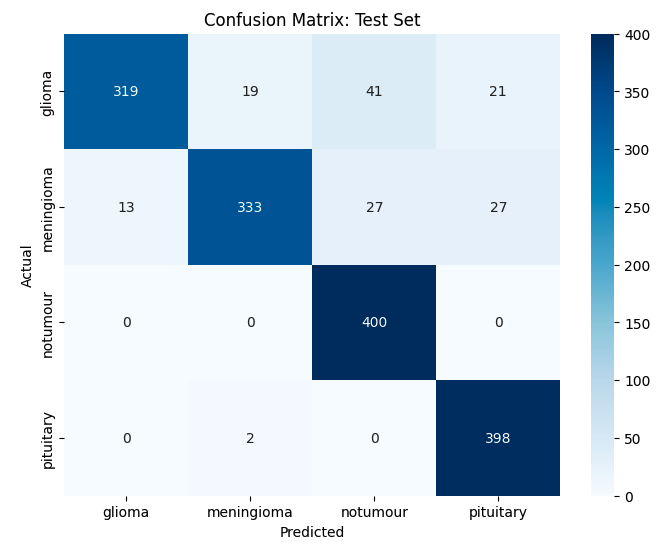
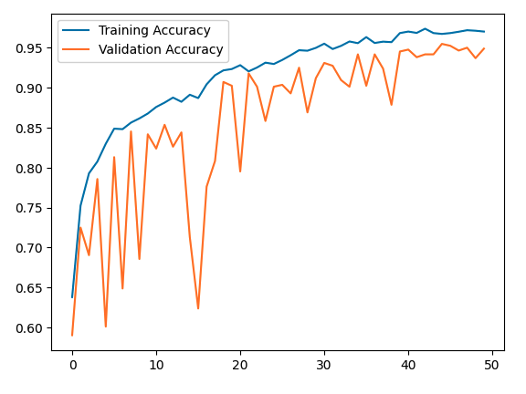
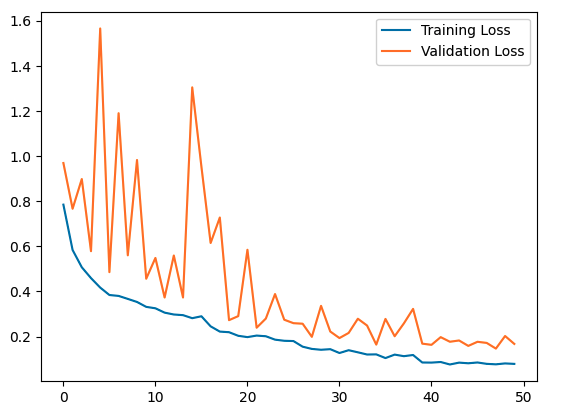

# MRI Tumour Classifier

Custom CNN implemented from scratch in PyTorch to classify brain MRI scans into four classes: `glioma`, `meningioma`, `pituitary` and `notumour` (no tumour). The model is not a fine-tuned pretrained backbone but rather a small convolutional network trained on the Kaggle "Brain Tumor MRI Dataset" by `masoudnickparvar`.

## Results

- **Overall accuracy: 91%** (1450 / 1600 correct on the test set)

Per class precision / recall / F1 as produced by the notebook's `classification_report`:

| Class | Precision | Recall | F1-score |
|---|---|---|---|
| Glioma | 0.96 | 0.80 | 0.87 |
| Meningioma | 0.94 | 0.83 | 0.88 |
| No tumour | 0.85 | 1.00 | 0.92 |
| Pituitary | 0.89 | 0.99 | 0.94 |

Figures (produced by notebook):

- 
- 
- 

> *Exact values will vary when running the notebook due to data augmentation and randomness in dropout.*

## Model iteration and analysis

The model went through several rounds of improvements to move from an initial 85% baseline to a better result. Key changes:

- Rebuilt the architecture into a deeper 3-block CNN with batch normalization and adaptive average pooling
- Fixed a data leakage issue since checkpointing was previously based on test set performance, meaning the test set was implicitly influencing model selection. This was fixed with a proper stratified train/validation/test split
- Added data augmentation (random horizontal flip, random rotation) to the training set
- Increased dropout for stronger regularisation
- Added learning rate scheduling

Together these brought the model to an improved and validated **91% test accuracy**.

As a smaller final adjustment, the loss function's class weight on glioma was refined (1.5 -> 2.2 -> 2.0) to address a recall gap where glioma was being under-predicted compared to the other three classes. This increased glioma recall from 0.75 to 0.80, but overall accuracy barely changed. The gain was offset by a drop in meningioma recall. Most of the model's remaining errors are concentrated between these two classes specifically (see confusion matrix), while `notumour` and `pituitary` are classified almost perfectly, suggesting the model struggles to separate these two classes cleanly, rather than this being a simple class imbalance issue. A deeper or pretrained network would likely separate these classes better.

## Architecture

Model defined in the notebook (`ConvolutionalNetwork`) summary:

- Input: single-channel (grayscale) images resized and padded to 224 x 224
- Convolutional blocks:
  - Block 1: `Conv2d(1 -> 32)` x2 + BatchNorm + ReLU
  - Block 2: `Conv2d(32 -> 64)` x2 + BatchNorm + ReLU
  - Block 3: `Conv2d(64 -> 128)` x2 + BatchNorm + ReLU
- Pooling: `MaxPool2d(2,2)` after each block
- Global pooling: `AdaptiveAvgPool2d(1)` to produce a 128-dimensional feature vector
- Head: `Linear(128 -> 128)` + ReLU + `Dropout(p=0.5)` + `Linear(128 -> 4)`, producing the output logits

## Training details (as in notebook)

- Optimiser: `torch.optim.Adam(model.parameters(), lr=0.001, weight_decay=1e-4)`
- Scheduler: `ReduceLROnPlateau(optimiser, mode='min', factor=0.5, patience=3)`
- Loss: `nn.CrossEntropyLoss(weight=class_weights)` with final `class_weights = torch.tensor([2.0, 1.0, 1.0, 1.0]).to(device)` (glioma weighted higher)
- Epochs: `50`
- Batch size: `32`
- Gradient clipping: `torch.nn.utils.clip_grad_norm_(model.parameters(), max_norm=1.0)` during training
- Augmentation (for training): `Grayscale(num_output_channels=1)`, `RandomHorizontalFlip()`, `RandomRotation(10)`, custom `ResizeWithPad(224)`, `ToTensor()`, `Normalize(mean=[0.5], std=[0.5])`
- Evaluation transforms: same as above but without random flip or rotation
- Train/validation split:
  - Training folder loaded twice via `datasets.ImageFolder`, once with `transformTrain` (augmented) and once with `transformEval` (no augmentation)
  - Stratified split on the label indices using `sklearn.model_selection.train_test_split` (`test_size=0.15`, `stratify=targets`, `random_state=67`)
  - `torch.utils.data.Subset` applies the matching transform to each split
- Test set: the separate `Testing` folder from the Kaggle dataset, loaded via `datasets.ImageFolder(root=test_root, transform=transformEval)`

## Dataset

- Source: Kaggle - "Brain Tumor MRI Dataset" by `masoudnickparvar`
- 7200 images across 4 balanced classes: glioma, meningioma, pituitary and no tumour
- Training set: 5600 images (1400 per class)
- Testing set: 1600 images (400 per class)
- The notebook downloads the dataset automatically via `kagglehub.dataset_download("masoudnickparvar/brain-tumor-mri-dataset")` and uses `Training` / `Testing` subfolders
- Link: https://www.kaggle.com/datasets/masoudnickparvar/brain-tumor-mri-dataset

## How to run

1. Clone the repo:

```bash
git clone https://github.com/kavi656/mri-tumour-classifier
cd mri-tumour-classifier
```

2. Install Python dependencies:

```bash
python -m pip install -r requirements.txt
```

3. Open and run the notebook's code blocks in order: `mri-tumour-classifier.ipynb`

Notes:
- `my-mri-model.pt` is not included in the repo. Running the notebook will train the model from scratch and save the weights locally when validation loss improves.
- To ensure model portability between GPU and CPU, load the checkpoint with `torch.load('my-mri-model.pt', map_location=device)` if running on a different device

## License

MIT License - Feel free to use, modify and distribute this project.